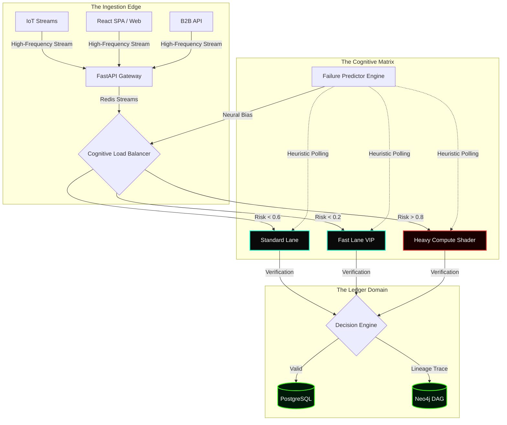

# 🛡️ Aegis: Autonomous Data & Decision Infrastructure

<div align="center">
  
  
  
  
</div>

<br/>

Aegis is a highly complex, mission-critical autonomous data infrastructure system. It bridges a hyper-parallel asynchronous Python backend with a high-density cybernetic Next.js control UI. 

Designed without the need for human intervention, Aegis acts as a complete "neural brain" for backend services—automatically ingesting streaming data, tracking deep cryptographic provenance, predicting node failure using statistical heuristics, and dynamically shedding network traffic.

---

## 📐 System Architecture Flow

The system operates across three core domains: the **Ingestion Edge**, the **Cognitive Matrix**, and the **Ledger Domain**.



---

## 🧮 Mathematical Foundations

Aegis utilizes several low-level algorithmic formulas to run its failure prediction and traffic-shedding mechanisms autonomously.

### 1. Predictive Failure Heuristic (Time-Series Outlier Detection)

Failure probability $P(F_t)$ at any given epoch $t$ is calculated via an exponentially weighted stress function combining latency variance and CPU drift across the node cluster.

$$ P(F_t) = \sigma \left( \alpha \frac{\mathcal{L}_t - \mu_{\mathcal{L}}}{\sigma_{\mathcal{L}}} + \beta \Delta C_t + \lambda \sum_{i=1}^{k} e^{-\gamma d_i} \right) $$

Where:
*   $\sigma(x)$ is the sigmoid activation bounds function $1 / (1 + e^{-x})$
*   $\mathcal{L}_t$ is the real-time node latency.
*   $\Delta C_t$ is the second-derivative rate of change in CPU core temperatures/loads.
*   $\lambda$ represents the decay coefficient over localized network faults.

### 2. Cognitive Traffic Shedding (Dynamic M/M/C Queuing Network)

When $P(F_t) > \tau_{critical}$, the system must divert incoming Poisson traffic $\lambda$ to separate asynchronous priority lanes. The expected queue length $E[L_q]$ is clamped actively by mutating the service rate $\mu$:

$$ E[L_q] = \frac{P_0 \cdot \left(\frac{\lambda}{\mu}\right)^c \cdot \rho}{c! (1 - \rho)^2} $$

Aegis algorithmically re-allocates concurrent worker threads ($c$) in the background to guarantee that $\rho$ (utilization factor $\frac{\lambda}{c\mu}$) never exceeds $0.95$. If $\rho \geq 0.95$, the system defaults the routing tensor to `DEFENSIVE_THROTTLE` or `HEAVY_COMPUTE`.

---

## 👁️ Core Intelligence Dashboard (UI)

The frontend command center is written in Next.js/React using pure SVG mapping and highly complex grid overlays. It visualizes the aforementioned math in real-time.

1. **Active Telemetry Matrix:** Terminal-style tables providing live feeds of geo-IP originations, HTTP payload sizes, execution latencies, and cryptographic hashes.
2. **Dynamic Routing Topology:** A live animated SVG tree representing the real-time diversion of traffic packets via glowing particle arrays as the cognitive router modifies $E[L_q]$.
3. **Provenance DAG:** Directed Acyclic execution graphs mapping data from `RAW_EVENT` → `CLEANED` → `ENRICHED` → `NEO4J`.

---

## 🚀 Running the System

To initialize the holistic Aegis core locally via Docker and Node:

### 1. Boot the Databases (PostgreSQL, Redis, Neo4j)
```bash
cd aegis
docker-compose up -d
```

### 2. Boot the Python Backend & Simulator
```bash
cd aegis
# Setup environment and install dependencies
python -m venv venv
venv\Scripts\activate
pip install -r requirements.txt

# Start the neural FastAPI backend
uvicorn src.main:app --reload

# (Optional) in a separate terminal, to trigger the math formulas logic:
python simulation/run_sim.py
```

### 3. Boot the Cybernetic UI
```bash
cd aegis-ui
# The system utilizes Tailwind CSS, Recharts, and Lucide React
npm install
npm run dev
```

The system will initialize bounds at `http://localhost:3000`. Watch the Live Compute Matrix light up as data streams through the DAG!

---
*Created strictly for high-load autonomous decision environments.*
